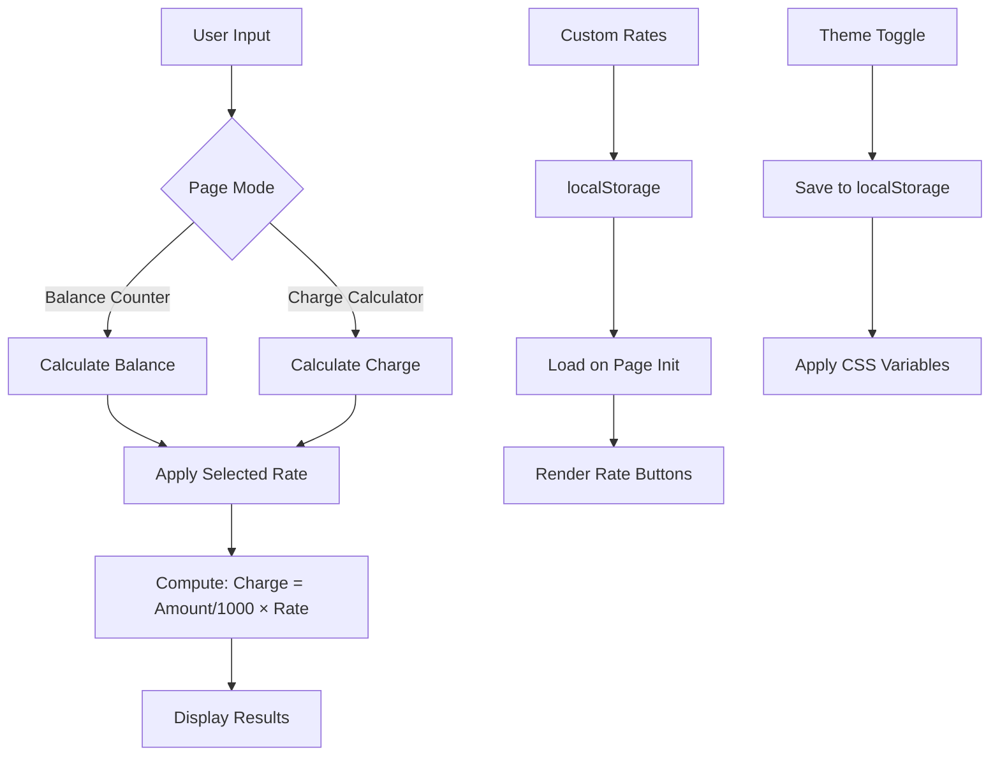

# Cashout Counter

A lightweight, mobile-first web calculator for computing bKash cash out charges in Bangladesh with customizable rates and dual calculation modes.

[](https://opensource.org/licenses/MIT)
[](https://github.com/Shishir-ip/bkash-cashout-counter/stargazers)
[](https://github.com/Shishir-ip/bkash-cashout-counter/network/members)
[](https://github.com/Shishir-ip/bkash-cashout-counter/issues)
[](https://bkash-cashout-counter.vercel.app/)

---

## 📱 Live Demo

**[Try it now →](https://bkash-cashout-counter.vercel.app/)**


---

## Overview

Cashout Counter is a specialized calculator designed for bKash users in Bangladesh who need to quickly compute cash out amounts with various service charges. Whether you're calculating how much you'll receive from a balance withdrawal or determining the charge for a specific amount, this tool provides instant results with support for multiple rate tiers including Priyo/ATM, Regular, Nagad, and custom rates.

Built as a single-page application with zero dependencies, it works offline after first load, supports dark/light themes, and saves custom rates locally for persistent access.

### Who Should Use This

- **bKash users** calculating cash out amounts before transactions
- **Mobile financial service agents** verifying charges quickly
- **Bangladesh residents** comparing different cash out rates
- **Developers** looking for a clean, vanilla JS calculator reference

---

## Key Features

* **Dual Calculation Modes** — Switch between "Balance Counter" (how much you receive) and "Charge Calculator" (how much fee applies)
* **Pre-configured Rates** — Built-in rates for Priyo/ATM (13.95৳), Nagad Regular (12.99৳), Nagad Islamic (15৳), and Regular tiers
* **Custom Rate Management** — Add, edit, and delete personalized rates saved to localStorage
* **Persistent Storage** — Custom rates and theme preference survive page reloads
* **Dark/Light Theme** — Toggle between themes with automatic system detection
* **Mobile-First Design** — Optimized for mobile screens with responsive layout
* **Zero Dependencies** — Pure HTML, CSS, and JavaScript (no frameworks required)
* **PWA Ready** — Installable as a progressive web app with offline support
* **Fast Performance** — Instant calculations with no network requests

---

## Tech Stack

| Technology | Purpose |
| ---------- | ------- |
| HTML5 | Semantic structure and meta tags |
| CSS3 (Custom Properties) | Styling with CSS variables for theming |
| Vanilla JavaScript (ES6+) | Logic, calculations, and localStorage management |
| Web Storage API | Persistent storage for custom rates and theme |
| SVG (Inline) | Favicon and icons without external requests |
| PWA Manifest | Installability and mobile app experience |

---

## Architecture



---

## Project Structure

```text
cashout-counter/
├── index.html          # Single-file application (HTML + CSS + JS)
├── README.md           # Project documentation
└── .gitignore          # Git ignore rules
```

The entire application resides in a single `index.html` file containing:
- **Lines 1–20**: Meta tags, favicon, PWA manifest
- **Lines 21–633**: CSS styles with CSS custom properties for theming
- **Lines 634–997**: HTML structure (header, input sections, results, footer)
- **Lines 998–1314**: JavaScript logic (calculations, localStorage, UI interactions)

---

## Requirements

* **Browser Support**: Modern browsers with ES6+ support
  - Chrome 60+
  - Firefox 60+
  - Safari 12+
  - Edge 79+
  - Mobile browsers (iOS Safari, Chrome Mobile)
* **No build tools required** — Works directly by opening the HTML file
* **No server required** — Can run locally or be hosted statically

---

## Installation

### Option 1: Clone Repository

```bash
git clone https://github.com/Shishir-ip/bkash-cashout-counter.git
cd bkash-cashout-counter
```

Then open `index.html` in your browser.

### Option 2: Download Directly

Download [`index.html`](https://raw.githubusercontent.com/Shishir-ip/bkash-cashout-counter/main/index.html) and open it in any modern browser.

### Option 3: Use Live Demo

Visit **[https://bkash-cashout-counter.vercel.app/](https://bkash-cashout-counter.vercel.app/)** — no installation needed.

---

## Usage

### Balance Counter Mode

Calculate how much you'll receive after cash out charges:

1. Select **"Balance Counter"** tab
2. Enter your account balance (e.g., `1000`)
3. Choose a rate tier (e.g., `13.95৳ Priyo/ATM`)
4. Click **Calculate**
5. View breakdown: Total Balance, Cash Out Charge, Final Amount

**Example:**
```
Input: 1000৳
Rate: 13.95৳ per 1000৳
Charge: 13.95৳
You Receive: 986.05৳
```

### Charge Calculator Mode

Calculate the charge for a specific cash out amount:

1. Select **"Charge Calculator"** tab
2. Enter the amount you want to cash out
3. Choose a rate tier
4. Click **Calculate**
5. View: Total Amount, Cash Out Charge, You'll Pay

### Adding Custom Rates

1. Click **"➕ Add Rate"** button
2. Enter a name (default: "Custom rate") — optional to change
3. Enter the rate value (required) — e.g., `14.5`
4. Click OK — rate appears in the grid
5. Rate persists across sessions via localStorage

### Editing/Deleting Custom Rates

- **Hover** over or **select** a custom rate button
- Click **✏️** to edit name/value
- Click **🗑️** to delete permanently

### Theme Toggle

Click the **☀️/🌙** icon in the header to switch between light and dark themes. Preference is saved automatically.

---

## Calculations

### Balance Counter Formula

```javascript
charge = (balance / 1000) × rate
finalAmount = balance - charge
```

### Charge Calculator Formula

```javascript
charge = (amount / 1000) × rate
totalPayable = amount + charge
```

**Note:** Rates represent the fee per 1000৳. For example, 13.95৳ means 13.95৳ charge for every 1000৳ transacted.

---

## Default Rates

| Rate Name | Value (per 1000৳) | Description |
| --------- | ----------------- | ----------- |
| Priyo/ATM | 13.95৳ | Reduced rate for Priyo accounts or ATM withdrawals |
| Nagad Regular | 12.99৳ | Standard Nagad cash out rate |
| Nagad Islamic | 15৳ | Shariah-compliant Nagad rate |
| Regular | 18.50৳ | Standard bKash cash out rate |

---

## Deployment

### Deploy to Vercel

1. Fork this repository
2. Go to [Vercel](https://vercel.com/)
3. Import your forked repository
4. Deploy (no configuration needed)

### Deploy to Netlify

1. Fork this repository
2. Go to [Netlify](https://netlify.com/)
3. Connect your GitHub repository
4. Deploy (build settings not required)

### Deploy to GitHub Pages

1. Go to repository Settings → Pages
2. Select source branch (main) and root folder
3. Save — site will be available at `https://username.github.io/repo-name`

### Local Hosting

```bash
# Using Python 3
python -m http.server 8000

# Using Node.js (npx)
npx serve .

# Using PHP
php -S localhost:8000
```

Then visit `http://localhost:8000`

---

## Configuration

### Environment Variables

None required. The application runs entirely client-side.

### Customization

To modify default rates, edit the `renderDefaultRates()` function calls in `index.html`:

```javascript
// Around line 1149-1160 for Balance page
// Around line 1170-1180 for Charge page
```

To change theme colors, modify CSS custom properties in `:root`:

```css
:root {
    --primary: #D12053;        /* bKash pink */
    --primary-dark: #b01a45;
    --primary-light: #ff1a6b;
}
```

---

## Browser Compatibility

| Browser | Version | Status |
| ------- | ------- | ------ |
| Chrome | 60+ | ✅ Fully Supported |
| Firefox | 60+ | ✅ Fully Supported |
| Safari | 12+ | ✅ Fully Supported |
| Edge | 79+ | ✅ Fully Supported |
| iOS Safari | 12+ | ✅ Fully Supported |
| Chrome Mobile | 60+ | ✅ Fully Supported |
| Samsung Internet | 8+ | ✅ Fully Supported |

---

## Limitations

* **Client-side only** — No backend validation; calculations depend on user input accuracy
* **Single currency** — Designed specifically for Bangladeshi Taka (৳)
* **Rate updates** — Default rates are hardcoded; users must manually update if bKash changes official rates
* **localStorage dependency** — Clearing browser data removes custom rates and theme preference
* **No API integration** — Does not fetch live rates from bKash servers

---

## Roadmap

### Completed ✅
- Dual calculation modes (Balance/Charge)
- Pre-configured rate tiers
- Custom rate CRUD operations
- localStorage persistence
- Dark/light theme toggle
- Mobile-responsive design
- PWA installability
- Edit/delete custom rates

### Planned 🚧
- [ ] Rate history tracking
- [ ] Multiple currency support (USD, INR)
- [ ] Export calculation history
- [ ] Share results via link
- [ ] Bilingual support (Bengali/English)
- [ ] Unit tests with Jest

---

## Contributing

Contributions are welcome! Follow these steps:

1. **Fork** the repository
2. **Create a branch** for your feature:
   ```bash
   git checkout -b feature/your-feature-name
   ```
3. **Make changes** to `index.html`
4. **Test** in multiple browsers (Chrome, Firefox, Safari, mobile)
5. **Commit** with clear messages:
   ```bash
   git commit -m "Add: description of your feature"
   ```
6. **Push** to your branch:
   ```bash
   git push origin feature/your-feature-name
   ```
7. **Open a Pull Request** describing your changes

### Code Style Guidelines

- Use semantic HTML5 elements
- Follow CSS custom properties for theming
- Write vanilla JavaScript (ES6+) — no frameworks
- Keep single-file architecture intact
- Test on mobile devices before submitting
- Comment complex logic

---

## Development

### Local Development

```bash
# Clone repository
git clone https://github.com/Shishir-ip/bkash-cashout-counter.git
cd bkash-cashout-counter

# Start local server (optional)
python -m http.server 8000

# Open in browser
open index.html  # macOS
xdg-open index.html  # Linux
start index.html  # Windows
```

### Testing Checklist

Before deploying changes:

- [ ] Test both calculation modes
- [ ] Verify all default rates work correctly
- [ ] Add, edit, and delete custom rates
- [ ] Reload page to confirm localStorage persistence
- [ ] Toggle dark/light theme
- [ ] Test on mobile viewport (320px–480px)
- [ ] Verify PWA installability
- [ ] Check keyboard navigation (Enter key triggers calculate)
- [ ] Validate number input (reject non-numeric)

---

## Security Considerations

* **No sensitive data** — Application does not collect personal information
* **Client-side only** — All calculations happen locally; no data sent to servers
* **No authentication** — No login or user accounts
* **localStorage warnings** — Users should know clearing browser data removes custom rates
* **XSS prevention** — User input is sanitized via `parseFloat()` and template literals

⚠️ **Important**: Do not store sensitive financial information in custom rate names.

---

## Performance

* **First Contentful Paint**: < 1s on 3G networks
* **Time to Interactive**: < 2s on mid-range mobile devices
* **Bundle Size**: ~45KB (single HTML file, gzipped)
* **No external requests** after initial load
* **Offline capable** via browser cache

Optimization techniques used:
- Inline CSS and JavaScript (no HTTP requests)
- Minimal DOM manipulation
- Efficient event delegation
- CSS containment for animations
- System font stack (no web fonts)

---

## Acknowledgements

* **bKash** — Bangladesh's leading mobile financial service (rate reference)
* **Nagad** — Postal service digital financial platform
* **Web Standards** — W3C HTML, CSS, and JavaScript specifications
* **Community** — Open-source contributors and users providing feedback

---

## Author

**Shohidul Islam Shishir**

- GitHub: [@Shishir-ip](https://github.com/Shishir-ip)
- Facebook: [imshishr](https://facebook.com/imshishr)

---

## License

This project is licensed under the **MIT License** — see below for details:

```
MIT License

Copyright (c) 2025 Shohidul Islam Shishir

Permission is hereby granted, free of charge, to any person obtaining a copy
of this software and associated documentation files (the "Software"), to deal
in the Software without restriction, including without limitation the rights
to use, copy, modify, merge, publish, distribute, sublicense, and/or sell
copies of the Software, and to permit persons to whom the Software is
furnished to do so, subject to the following conditions:

The above copyright notice and this permission notice shall be included in all
copies or substantial portions of the Software.

THE SOFTWARE IS PROVIDED "AS IS", WITHOUT WARRANTY OF ANY KIND, EXPRESS OR
IMPLIED, INCLUDING BUT NOT LIMITED TO THE WARRANTIES OF MERCHANTABILITY,
FITNESS FOR A PARTICULAR PURPOSE AND NONINFRINGEMENT. IN NO EVENT SHALL THE
AUTHORS OR COPYRIGHT HOLDERS BE LIABLE FOR ANY CLAIM, DAMAGES OR OTHER
LIABILITY, WHETHER IN AN ACTION OF CONTRACT, TORT OR OTHERWISE, ARISING FROM,
OUT OF OR IN CONNECTION WITH THE SOFTWARE OR THE USE OR OTHER DEALINGS IN THE
SOFTWARE.
```

---

## Support

If you find this project useful:

- ⭐ **Star** this repository on GitHub
- 🔗 **Share** with others who use bKash
- 🐛 **Report** bugs via [GitHub Issues](https://github.com/Shishir-ip/bkash-cashout-counter/issues)
- 💡 **Suggest** features or improvements

---

## Keywords

bKash calculator, cash out charge calculator, Bangladesh mobile banking, bKash rate calculator, Nagad calculator, mobile financial services, cash out fee calculator, bKash Priyo rate, Bangladesh finance tool, vanilla JS calculator, PWA calculator, localStorage calculator

---

<div align="center">

**Made with ❤️ for Bangladesh**

[Report Issue](https://github.com/Shishir-ip/bkash-cashout-counter/issues) • [Request Feature](https://github.com/Shishir-ip/bkash-cashout-counter/issues) • [View Demo](https://bkash-cashout-counter.vercel.app/)

</div>
